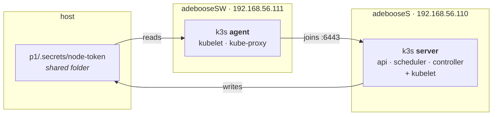
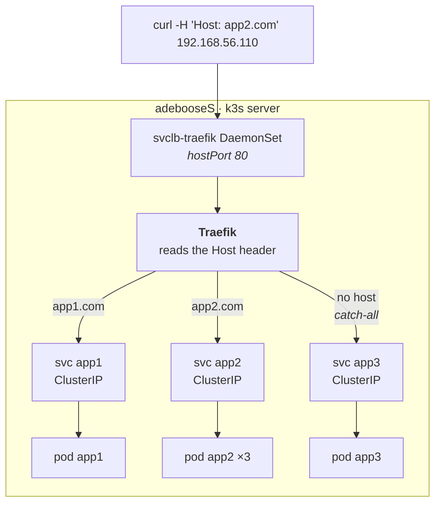
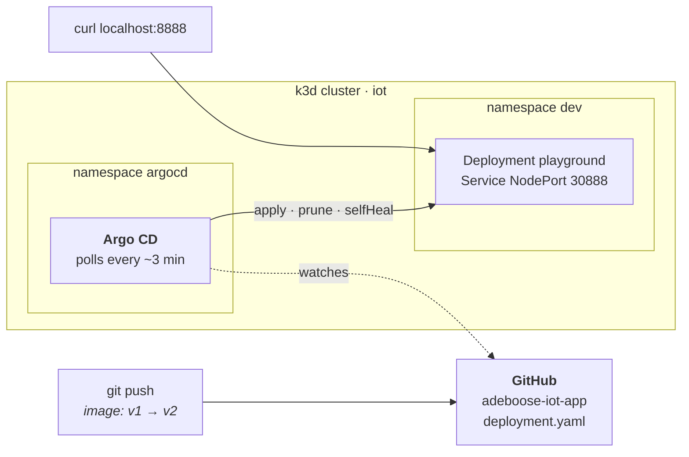

# Inception-of-Things

42 project — building up from a bare k3s cluster to a GitOps pipeline driven by
Argo CD.

| Part | What it builds | Validated by |
|------|----------------|--------------|
| `p1` | 2 VMs, k3s server + agent | 2 nodes `Ready` with the right internal IPs |
| `p2` | 1 VM, 3 apps routed by HTTP `Host` header | 3 curls returning app1 / app2 / app3 |
| `p3` | k3d cluster, Argo CD syncing a GitHub repo | image tag `v1` → `v2` in git, cluster follows |
| `bonus` | GitLab in the cluster, replacing GitHub as the source | a commit that exists only on the local GitLab reaches the cluster |

Everything is rebuilt from scratch by scripts — `vagrant up` for `p1` and `p2`,
two scripts for `p3`. Nothing is configured by hand, and every part below was
replayed from zero and checked with the commands it shows.

> `p1` and `p2` both claim `192.168.56.110`. Never run them at once — two live
> VMs on one IP produce no error, ARP just picks a winner.

## Environment

Built and tested on **macOS, Apple Silicon (arm64)**, and written to replay on an
**x86 Linux box** without edits:

- **Two provider blocks per VM** — `virtualbox` and `vmware_desktop`. Vagrant
  applies the one it finds installed, so `vagrant up` takes no flag on either
  machine. VMware is what arm64 macOS needs; VirtualBox is the usual 42 setup.
- **Box `bento/ubuntu-26.04`** — current LTS, published for both architectures
  and both providers.
- **Images built for `linux/amd64,linux/arm64`** — same manifests, both CPUs.

| | macOS arm64 | linux x86 |
|---|---|---|
| `p1`, `p2` | vagrant + vmware-desktop plugin | vagrant + virtualbox |
| `p3`, `bonus` | orbstack machine `iot` | virtualbox VM `iot`, debian 13 |

On Linux, VirtualBox 7 rejects host-only ranges that are not allowlisted, and the
file does not exist out of the box:

```sh
echo "* 192.168.56.0/21" | sudo tee /etc/vbox/networks.conf
```

### The p3 host

`p1` and `p2` are Vagrant VMs, as the subject requires. `p3` says *without
Vagrant this time*, so it gets a plain Linux VM that Vagrant did not build. Its
install scripts start from a bare Debian or Ubuntu — including `curl` and `git`,
which a minimal Debian does not ship — and read the architecture from `dpkg`.

**macOS** — `orb create ubuntu:resolute iot`, then `orb -m iot`. The repo is at
the same path.

**Linux** — a Debian 13 netinst, 4 CPU / 8 GB / 40 GB (GitLab sets those
numbers), no desktop. VM powered off, forward the ports the cluster publishes:

```sh
VBoxManage modifyvm iot --natpf1 "argocd,tcp,127.0.0.1,8080,,8080"
VBoxManage modifyvm iot --natpf1 "app,tcp,127.0.0.1,8888,,8888"
VBoxManage modifyvm iot --natpf1 "gitlab,tcp,127.0.0.1,8081,,8081"
VBoxManage modifyvm iot --natpf1 "ssh,tcp,127.0.0.1,2222,,22"
```

Then `ssh -p 2222 <user>@127.0.0.1` and clone the repo — no shared folder here,
unlike Vagrant.

## p1 — k3s server and agent



The token travels server → host → agent through the folder Vagrant shares, which
is why the server must finish provisioning before the agent starts. It is
gitignored.

```sh
cd p1 && vagrant up
vagrant ssh adebooseS -c "kubectl get nodes -o wide"
```

```
NAME         STATUS   ROLES           VERSION        INTERNAL-IP
adebooses    Ready    control-plane   v1.36.3+k3s1   192.168.56.110
adeboosesw   Ready    <none>          v1.36.3+k3s1   192.168.56.111
```

## p2 — three apps behind one Ingress

The full path of one request, which is also the answer to *how do you reach a
ClusterIP from outside*:



```sh
cd p2 && vagrant up

curl -H "Host: app1.com" 192.168.56.110    # app1
curl -H "Host: app2.com" 192.168.56.110    # app2, repeat it: the pod name changes
curl 192.168.56.110                        # app3, default
```

A single Ingress carries all three rules. The third has **no `host`**, which
makes it the catch-all. `app2` runs 3 replicas, and the page prints the pod name
that answered.

## p3 — GitOps with Argo CD

Git is the source of truth: the cluster is never modified directly.



Both commands run **inside the `iot` machine**, on a box that starts with neither
docker nor kubectl:

```sh
sudo bash p3/scripts/install.sh   # docker, kubectl, k3d, git (debian/ubuntu)
bash p3/scripts/start.sh          # cluster, namespaces, argo cd, Application
```

`start.sh` prints the Argo CD URL and the generated admin password.

| | inside the VM | from the macOS host | from the linux host |
|---|---|---|---|
| Argo CD UI | http://localhost:8080 (`admin`) | http://iot.orb.local:8080 | http://localhost:8080 |
| App | http://localhost:8888 | http://iot.orb.local:8888 | http://localhost:8888 |

OrbStack gives the machine a hostname; VirtualBox forwards the ports instead,
which is why the Linux column is loopback.

Watched repo: [Pokalie566/adeboose-iot-app](https://github.com/Pokalie566/adeboose-iot-app).
Changing the image tag there and pushing is enough — no `kubectl`:

```sh
sed -i 's/iot-app:v1/iot-app:v2/' deployment.yaml
git commit -am "bump to v2" && git push
```

Argo CD polls roughly every 3 minutes, so the delay is whatever is left of that
window: **93 s** measured from `git push` to `v2` being served. A hard refresh
skips the poll:

```sh
kubectl -n argocd annotate app playground argocd.argoproj.io/refresh=hard --overwrite
```

## bonus — the same pipeline, off a self-hosted GitLab

Same `iot` machine, same cluster as p3:

```sh
bash bonus/scripts/install_gitlab.sh    # namespace gitlab, ~10 min on first boot
bash bonus/scripts/push_to_gitlab.sh    # creates the public project, mirrors the manifests
kubectl apply -f bonus/confs/application.yaml
```

The Application keeps its name and destination; only `repoURL` moves from GitHub
to `gitlab.gitlab.svc.cluster.local:8081`, which Argo CD resolves through CoreDNS
from inside the cluster.

Proven by committing a rollback to `v1` **on the local GitLab only**. Argo CD
synced revision `36c6dd4`, a commit GitHub does not have — its `main` still
points at `08634e1` — and the cluster went back to `v1`, 23 s after a forced
refresh.

The pipeline needs no DNS on the host: `push_to_gitlab.sh` pushes from a pod,
where cluster DNS already works. Only a browser does — map the cluster name to
whatever address answers from that machine, in `/etc/hosts`.

## Notes

Things that are not obvious from reading the code.

**The private interface is detected, never hardcoded.** Each VM has two NICs:
Vagrant's NAT for SSH, and the private network. Left alone, k3s often binds the
wrong one — nodes still show `Ready`, but pod-to-pod traffic breaks because
Flannel's VXLAN tunnel sits on the NAT interface. The scripts ask *which
interface holds this IP* and pass the answer to `--node-ip` and
`--flannel-iface`. The name differs per provider (`eth1` here, `enp0s8` on
VirtualBox), so hardcoding it is not portable either.

**k3s waits for NTP before starting.** VMware writes the host's *local* time into
the virtual RTC, but the guest reads it as UTC — so the VM boots up to two hours
ahead until the clock is corrected. k3s started inside that window signs its
certificates with a `notBefore` in the future, and every later call dies on
`x509: certificate ... is not yet valid`. It is a race, so it fails
intermittently, which is worse than failing always. The barrier is one unit that
blocks until the clock is sane — but Ubuntu 26.04 ships **chrony** where 24.04
shipped systemd-timesyncd, so `systemd-time-wait-sync.service` no longer exists
and failed silently behind a green `vagrant up`. The scripts try `chrony-wait`
first, fall back to the old name, and refuse to install k3s if neither is there.

**ClusterIP services are still reachable from outside, and the last hop skips the
Service entirely.** Only Traefik is a `LoadBalancer`. With no cloud provider,
k3s's ServiceLB creates a `svclb-traefik` DaemonSet whose pods claim host ports
80 and 443. But Traefik never sends anything to `app2`'s ClusterIP: it watches the
EndpointSlices and load-balances across pod IPs itself, so kube-proxy never sees
that traffic. The packet counter on the nat rule proves it — ten requests through
the Ingress, then one straight at the ClusterIP:

```
10 requests via the Ingress   ->  0 pkts  KUBE-SVC-3CBU... /* default/app2 cluster IP */
1 curl on the ClusterIP       ->  1 pkts  KUBE-SVC-3CBU... /* default/app2 cluster IP */
```

**Ingress rules are ordered by specificity, not by file order.** Traefik gives
each rule a priority equal to its length, so ``Host(`app1.com`) &&
PathPrefix(`/`)`` always outranks a bare ``PathPrefix(`/`)``. The catch-all
cannot steal traffic from the named hosts.

**The image is built for two architectures.** `paulbouwer/hello-kubernetes` and
similar images are amd64-only and cannot run here.
[`pokalie566/adeboose-iot-app`](https://hub.docker.com/r/pokalie566/adeboose-iot-app)
is built with `docker buildx --platform linux/amd64,linux/arm64`, so the same
manifests work on Apple Silicon and on an x86 evaluation machine. The repository
name carries the 42 login, which the grading sheet asks for; the Docker Hub
account name (`pokalie566`) is not it.
