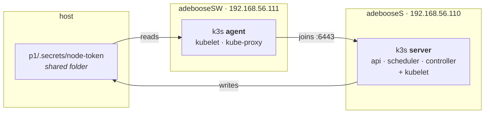
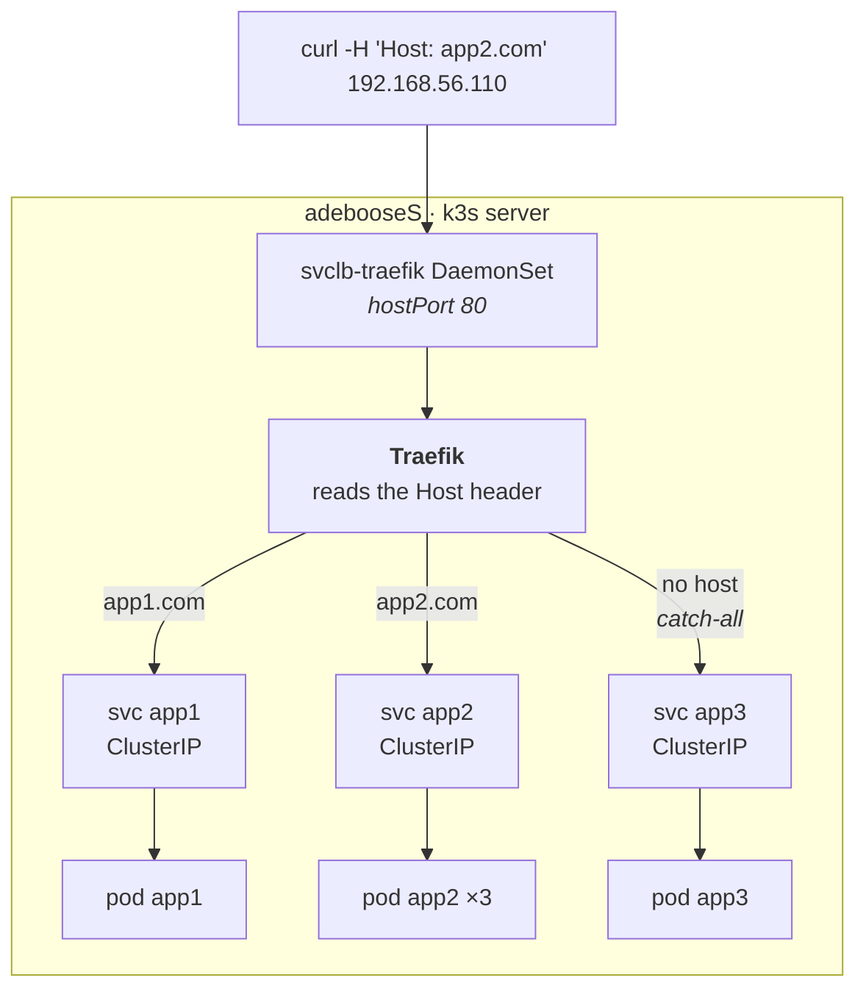
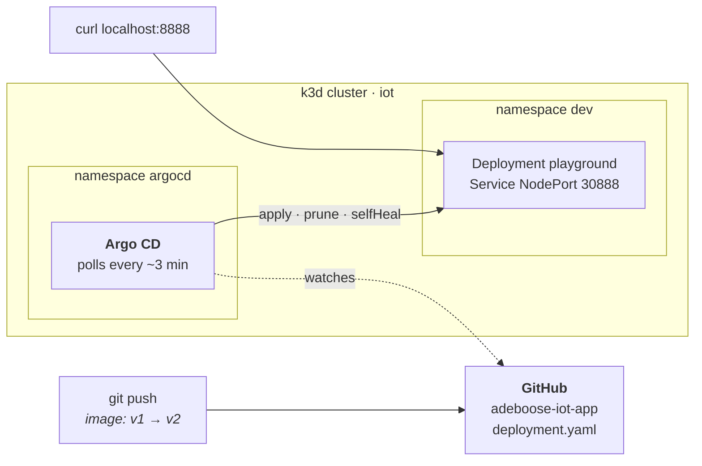

# Inception-of-Things

42 project — building up from a bare k3s cluster to a GitOps pipeline driven by
Argo CD.

| Part | What it builds | Validated by |
|------|----------------|--------------|
| `p1` | 2 VMs, k3s server + agent | 2 nodes `Ready` with the right internal IPs |
| `p2` | 1 VM, 3 apps routed by HTTP `Host` header | 3 curls returning app1 / app2 / app3 |
| `p3` | k3d cluster, Argo CD syncing a GitHub repo | image tag `v1` → `v2` in git, cluster follows |
| `bonus` | GitLab in the cluster, replacing GitHub as the source | a commit that exists only on the local GitLab reaches the cluster |

Everything is rebuilt from scratch by scripts — `vagrant up` for `p1` and `p2`,
two scripts for `p3`. Nothing is configured by hand, and every part below was
replayed from zero and checked with the commands it shows.

## Environment

Built and tested on **macOS, Apple Silicon (arm64)**, and written to replay on an
**x86 Linux box** without edits:

- **Two provider blocks per VM** — `virtualbox` and `vmware_desktop`. Vagrant
  applies the one it finds installed, so `vagrant up` takes no flag on either
  machine. VMware is what arm64 macOS needs; VirtualBox is the usual 42 setup.
- **Box `bento/ubuntu-26.04`** — current LTS, published for both architectures
  and both providers. Vagrant 2.4 picks the variant matching the host.
- **Images built for `linux/amd64,linux/arm64`** — same manifests, both CPUs.

| | macOS arm64 | linux x86 |
|---|---|---|
| `p1`, `p2` | vagrant + vmware-desktop plugin | vagrant + virtualbox |
| `p3`, `bonus` | orbstack machine `iot` | virtualbox VM `iot`, debian 13 |

One extra step on Linux: VirtualBox 7 rejects host-only ranges that are not
allowlisted, and the file does not exist out of the box.

```sh
echo "* 192.168.56.0/21" | sudo tee /etc/vbox/networks.conf
```

### The p3 host

`p1` and `p2` are Vagrant VMs, as the subject requires. `p3` says *without
Vagrant this time*, so it gets a plain Linux VM that Vagrant did not build. The
cluster inside it is built by `p3/scripts/start.sh`, run by hand.

The two scripts install everything from a bare Debian or Ubuntu — including
`curl` and `git`, which a minimal Debian does not ship — and read the
architecture from `dpkg`, so the same two commands work on either machine. Only
the way the VM is created differs.

**macOS** — one command:

```sh
orb create ubuntu:resolute iot # docker-free, kubectl-free
orb -m iot                     # shell in; the repo is at the same path
```

**Linux** — a Debian 13 netinst in VirtualBox, installed once: 4 CPU, 8 GB RAM,
40 GB disk (GitLab is what sets those numbers), no desktop, `ssh server` and
`standard system utilities` ticked. Then, VM powered off, forward the three
ports the cluster publishes so the host browser reaches them:

```sh
VBoxManage modifyvm iot --natpf1 "argocd,tcp,127.0.0.1,8080,,8080"
VBoxManage modifyvm iot --natpf1 "app,tcp,127.0.0.1,8888,,8888"
VBoxManage modifyvm iot --natpf1 "gitlab,tcp,127.0.0.1,8081,,8081"
VBoxManage modifyvm iot --natpf1 "ssh,tcp,127.0.0.1,2222,,22"
```

Boot it, `ssh -p 2222 <user>@127.0.0.1`, and clone the repo — there is no shared
folder here, unlike Vagrant:

```sh
sudo apt install -y git && git clone https://github.com/Pokalie566/IOT.git
```

## p1 — k3s server and agent



The token travels server → host → agent through the folder Vagrant shares, which
is why the server must finish provisioning before the agent starts.

```sh
cd p1 && vagrant up
vagrant ssh adebooseS -c "kubectl get nodes -o wide"
```

```
NAME         STATUS   ROLES           VERSION        INTERNAL-IP
adebooses    Ready    control-plane   v1.36.3+k3s1   192.168.56.110
adeboosesw   Ready    <none>          v1.36.3+k3s1   192.168.56.111
```

The agent joins with a token the server writes to `/vagrant/.secrets/`, the
folder Vagrant shares with the host. It is gitignored.

## p2 — three apps behind one Ingress

The full path of one request, which is also the answer to *how do you reach a
ClusterIP from outside*:



```sh
cd p2 && vagrant up

curl -H "Host: app1.com" 192.168.56.110    # app1
curl -H "Host: app2.com" 192.168.56.110    # app2
curl 192.168.56.110                        # app3, default
```

`app2` runs 3 replicas; repeating the second curl cycles through them, since the
page prints the pod name that answered.

A single Ingress carries all three rules. The third has **no `host`**, which
makes it the catch-all.

## p3 — GitOps with Argo CD

Git is the source of truth: the cluster is never modified directly.



Both commands run **inside the `iot` machine**, on a box that starts with
neither docker nor kubectl:

```sh
sudo bash p3/scripts/install.sh   # docker, kubectl, k3d, git (debian/ubuntu)
bash p3/scripts/start.sh          # cluster, namespaces, argo cd, Application
```

`start.sh` prints the Argo CD URL and the generated admin password.

| | inside the VM | from the macOS host | from the linux host |
|---|---|---|---|
| Argo CD UI | http://localhost:8080 (`admin`) | http://iot.orb.local:8080 | http://localhost:8080 |
| App | http://localhost:8888 | http://iot.orb.local:8888 | http://localhost:8888 |

OrbStack gives the machine a hostname; VirtualBox forwards the ports instead
(see [Environment](#the-p3-host)), which is why the Linux column is loopback.

Watched repo: [Pokalie566/adeboose-iot-app](https://github.com/Pokalie566/adeboose-iot-app)

Changing the image tag in that repo and pushing is enough — no `kubectl`:

```sh
sed -i 's/iot-app:v1/iot-app:v2/' deployment.yaml
git commit -am "bump to v2" && git push
```

Argo CD polls roughly every 3 minutes, so the delay is whatever is left of that
window: **93 s** measured from `git push` to `v2` being served. Not worth
waiting for during a demo — a hard refresh skips the poll:

```sh
kubectl -n argocd annotate app playground argocd.argoproj.io/refresh=hard --overwrite
```

## bonus — the same pipeline, off a self-hosted GitLab

Same `iot` machine, same cluster as p3:

```sh
bash bonus/scripts/install_gitlab.sh    # namespace gitlab, ~10 min on first boot
bash bonus/scripts/push_to_gitlab.sh    # creates the public project, mirrors the manifests
kubectl apply -f bonus/confs/application.yaml
```

The Application keeps its name and destination; only `repoURL` moves from
GitHub to `gitlab.gitlab.svc.cluster.local:8081`. Argo CD resolves that through
CoreDNS, from inside the cluster.

Proven by committing a rollback to `v1` **on the local GitLab only**. Argo CD
synced revision `36c6dd4`, a commit GitHub does not have — its `main` still
points at `08634e1` — and the cluster went back to `v1`, 23 s after a forced
refresh.

To reach the UI from a browser, the name has to resolve on whichever machine
runs the browser. Inside the VM it is loopback; on macOS it is the VM's address:

```sh
# inside the iot machine
echo "127.0.0.1 gitlab.gitlab.svc.cluster.local" | sudo tee -a /etc/hosts
# on macOS
echo "$(orbctl info iot | awk '/IPv4/{print $2}') gitlab.gitlab.svc.cluster.local" | sudo tee -a /etc/hosts
```

The pipeline itself does not need it — `push_to_gitlab.sh` pushes from a pod,
where cluster DNS already works.

## Notes

Things that are not obvious from reading the code.

**The private interface is detected, never hardcoded.** Each VM has two NICs:
Vagrant's NAT for SSH, and the private network. Left alone, k3s often binds the
wrong one — nodes still show `Ready`, but pod-to-pod traffic breaks because
Flannel's VXLAN tunnel sits on the NAT interface. The scripts ask *which
interface holds this IP* and pass the answer to `--node-ip` and
`--flannel-iface`. The name differs per provider (`eth1` here, `enp0s8` on
VirtualBox), so hardcoding it is not portable either.

**k3s waits for NTP before starting.** VMware writes the host's *local* time
into the virtual RTC, but the guest reads it as UTC — so the VM boots up to two
hours ahead until the clock is corrected. k3s started inside that window signs
its certificates with a `notBefore` in the future, and every later call dies on
`x509: certificate ... is not yet valid`. It is a race, so it fails
intermittently, which is worse than failing always.

The barrier is one unit that blocks until the clock is sane — but its name
changed: Ubuntu 26.04 ships **chrony** where 24.04 shipped systemd-timesyncd, so
`systemd-time-wait-sync.service` no longer exists. It failed silently on the
first 26.04 boot, leaving the race wide open behind a green `vagrant up`. The
scripts now try `chrony-wait` first, fall back to the old name, and refuse to
install k3s if neither is there.

**`kubectl wait --all` does not wait for nothing.** On an empty set it exits
with `no matching resources found` instead of blocking. Right after k3s starts,
no Node exists yet and no Traefik Deployment either — both are created
asynchronously. `--for=create` is the flag that actually waits for a resource to
appear.

**Traefik comes from a HelmChart CRD.** k3s drops manifests in
`/var/lib/rancher/k3s/server/manifests/`; `traefik.yaml` holds a `HelmChart`
object, an internal controller turns it into a Job, and that Job runs
`helm install`. Four asynchronous steps, hence the delay after the node is
`Ready`.

**Ingress rules are ordered by specificity, not by file order.** Traefik gives
each rule a priority equal to its length, so ``Host(`app1.com`) &&
PathPrefix(`/`)`` always outranks a bare ``PathPrefix(`/`)``. The catch-all
cannot steal traffic from the named hosts.

**ClusterIP services are still reachable from outside.** Only Traefik is a
`LoadBalancer`. With no cloud provider, k3s's ServiceLB creates a
`svclb-traefik` DaemonSet whose pods claim host ports 80 and 443. Traffic goes
`node:80 → svclb hostPort → traefik ClusterIP → traefik pod → app pod IP`.

**The last hop skips the Service entirely.** Traefik does not send anything to
`app2`'s ClusterIP: it watches the EndpointSlices and load-balances across pod
IPs itself, so kube-proxy never sees that traffic. The packet counter on the nat
rule proves it — ten requests through the Ingress, then one straight at the
ClusterIP:

```
10 requests via the Ingress   ->  0 pkts  KUBE-SVC-3CBU... /* default/app2 cluster IP */
1 curl on the ClusterIP       ->  1 pkts  KUBE-SVC-3CBU... /* default/app2 cluster IP */
```

**The image is built for two architectures.** `paulbouwer/hello-kubernetes` and
similar images are amd64-only and cannot run here.
[`pokalie566/adeboose-iot-app`](https://hub.docker.com/r/pokalie566/adeboose-iot-app)
is built with `docker buildx --platform linux/amd64,linux/arm64`, so the same
manifests work on Apple Silicon and on an x86 evaluation machine. The repository
name carries the 42 login, which the grading sheet asks for; the Docker Hub
account name (`pokalie566`) is not it.

## Defense

The order below follows the grading sheet. One part runs at a time — p1 and p2
both claim `192.168.56.110`.

### p1

```sh
cd p1 && vagrant up
vagrant ssh adebooseS      # and adebooseSW: password-less, Vagrant injects a key
hostname                   # adebooseS / adebooseSW
kubectl get nodes -o wide  # 2 nodes Ready, INTERNAL-IP .110 and .111
```

> **The sheet's network command does not show the required IP, and that is
> expected.** It reads `ip a show $(ip route | grep default | awk '{print $5}')`,
> which resolves to whatever interface carries the *default route* — on any
> Vagrant VM that is `eth0`, the NAT interface Vagrant needs for SSH:
>
> ```
> 2: eth0 ... inet 192.168.156.142/24     <- Vagrant's NAT, the default route
>    eth1 ... inet 192.168.56.110/24      <- the dedicated IP the subject asks for
> ```
>
> Show `ip -o -4 addr show` instead, then close it with `kubectl get nodes -o
> wide`: k3s advertises `192.168.56.110` as the node's `INTERNAL-IP`, which is
> what "dedicated IP" actually means here. This is structural to Vagrant, not a
> mistake in this repo.

### p2

```sh
cd p1 && vagrant destroy -f && cd ../p2 && vagrant up
vagrant ssh adebooseS -c "kubectl get nodes -o wide && kubectl get all"
vagrant ssh adebooseS -c "kubectl describe ingress apps"   # the Ingress, on request

curl -H "Host: app1.com" 192.168.56.110    # app1
curl -H "Host: app2.com" 192.168.56.110    # app2, repeat it: the pod name changes
curl 192.168.56.110                        # app3, no host -> catch-all
```

### p3 and bonus

p3 runs in the `iot` Linux VM, **not** on the host — see [Environment](#environment).
Everything below is typed inside it.

```sh
orb create ubuntu:noble iot        # if the machine does not exist yet
orb -m iot
sudo bash p3/scripts/install.sh    # docker, kubectl, k3d, git on a bare box
bash p3/scripts/start.sh           # prints the Argo CD password
kubectl get ns                     # argocd, dev
kubectl get pods -n dev
curl localhost:8888                # v1
```

Then edit `deployment.yaml` in the app repo, push, and watch Argo CD pick it up.

### Questions the sheet forces, and the short answers

| Asked | Answer |
|---|---|
| Why no Vagrantfile in `p3`? | The subject says *without Vagrant this time*, and the whole project must live in a VM — so p3 gets a plain Linux VM that Vagrant did not build. Vagrant provisions nothing there. |
| `curl localhost:8888` fails on macOS | `localhost` on the Mac is not `localhost` in the VM. Use `http://iot.orb.local:8888`, or curl from inside the VM as the subject does. |
| Namespace vs pod | A namespace is a naming scope for objects, not a machine and not a runtime. A pod is the smallest deployable unit: one or more containers sharing a network namespace and an IP. |
| Where is the login? | GitHub repo `adeboose-iot-app`, Docker Hub repo `pokalie566/adeboose-iot-app`, hostnames `adebooseS` / `adebooseSW`. |
| The two Docker Hub tags | `v1` and `v2`, both `linux/amd64` + `linux/arm64`. |
| Sync did not happen | Argo CD polls every ~3 min. Force it in the UI, or `kubectl -n argocd annotate app playground argocd.argoproj.io/refresh=hard --overwrite`. |
| Where does Argo CD get the right to write in `dev`? | A ClusterRoleBinding on the `argocd-application-controller` ServiceAccount — cluster-wide, so every namespace. |
| Reaching the GitLab UI from the Mac | Add the VM's IP to `/etc/hosts` under the cluster name (see [bonus](#bonus--the-same-pipeline-off-a-self-hosted-gitlab)). The name must resolve to the same host GitLab's nginx answers for. |

## Gotchas

- **Never run p1 and p2 at once** — both claim `192.168.56.110`. Two live VMs on
  one IP produce no error message at all: ARP picks a winner at random and
  answers come from whichever cluster won. `vmrun list` (or `VBoxManage list
  runningvms`) tells you what is actually running.
- **After deleting a VM, flush the host ARP cache** (`sudo arp -d
  192.168.56.110`) or the host keeps sending frames to a MAC that no longer
  exists.
- **k3d port mappings are frozen at cluster creation.** Getting them wrong means
  deleting and recreating the cluster.
- **GitLab protects `main` even when no protection rule is listed.** Replaying
  `push_to_gitlab.sh` after a demo pushes a history GitLab has diverged from, so
  it needs `--force` — which the implicit default-branch protection rejects,
  with an empty `protected_branches` list to mislead you. The script now creates
  an explicit rule carrying `allow_force_push: true`.
- **Node names are lowercased.** The host is `adebooseS`, the Kubernetes Node is
  `adebooses` — object names must be DNS-1123 compliant, and DNS is
  case-insensitive.
