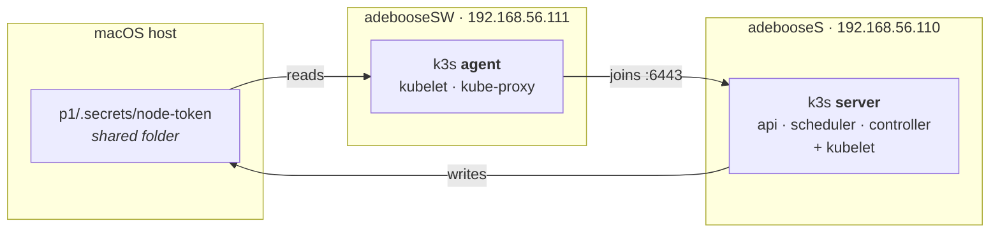
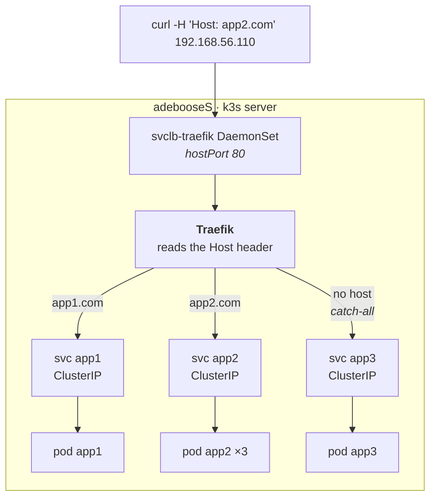
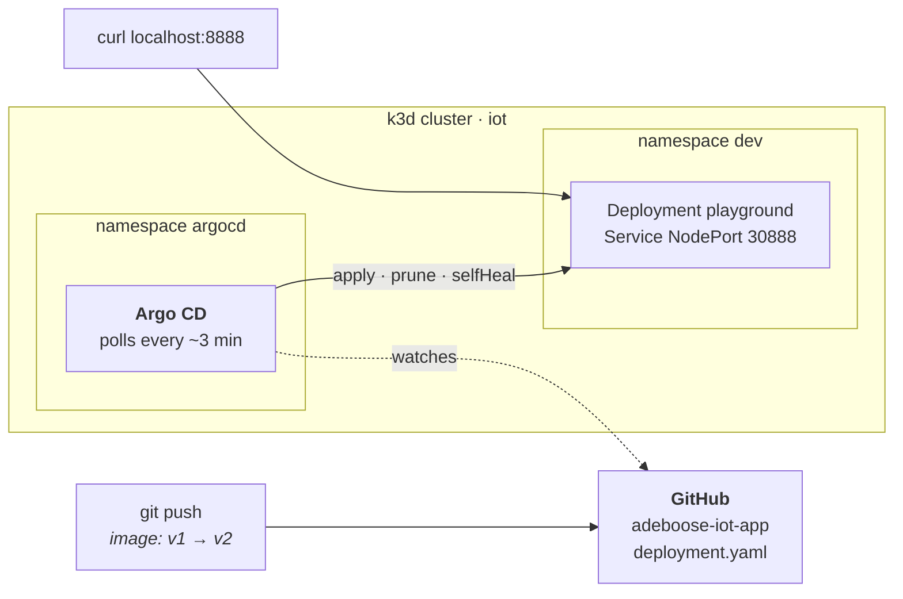

# Inception-of-Things

42 project — building up from a bare k3s cluster to a GitOps pipeline driven by
Argo CD.

| Part | What it builds | Validated by |
|------|----------------|--------------|
| `p1` | 2 VMs, k3s server + agent | 2 nodes `Ready` with the right internal IPs |
| `p2` | 1 VM, 3 apps routed by HTTP `Host` header | 3 curls returning app1 / app2 / app3 |
| `p3` | k3d cluster, Argo CD syncing a GitHub repo | image tag `v1` → `v2` in git, cluster follows |

Everything is rebuilt from scratch by a single command per part. Nothing is
configured by hand.

## Environment

Built and tested on **macOS, Apple Silicon (arm64)**. That constraint drives two
choices worth knowing about:

- **Provider `vmware_desktop`** — VirtualBox has no arm64 build, so the usual
  42 setup does not apply.
- **Box `bento/ubuntu-24.04`** — one of the few boxes published for both arm64
  and VMware. Ubuntu 24.04 is the current LTS, which is what the subject asks
  for.

```
vagrant 2.4.9 + vagrant-vmware-desktop plugin
docker (k3d only)
```

## p1 — k3s server and agent



The token travels server → host → agent through the folder Vagrant shares, which
is why the server must finish provisioning before the agent starts.

```sh
cd p1 && vagrant up
vagrant ssh adebooseS -c "kubectl get nodes -o wide"
```

```
NAME         STATUS   ROLES           VERSION        INTERNAL-IP
adebooses    Ready    control-plane   v1.36.3+k3s1   192.168.56.110
adeboosesw   Ready    <none>          v1.36.3+k3s1   192.168.56.111
```

The agent joins with a token the server writes to `/vagrant/.secrets/`, the
folder Vagrant shares with the host. It is gitignored.

## p2 — three apps behind one Ingress

The full path of one request, which is also the answer to *how do you reach a
ClusterIP from outside*:



```sh
cd p2 && vagrant up

curl -H "Host: app1.com" 192.168.56.110    # app1
curl -H "Host: app2.com" 192.168.56.110    # app2
curl 192.168.56.110                        # app3, default
```

`app2` runs 3 replicas; repeating the second curl cycles through them, since the
page prints the pod name that answered.

A single Ingress carries all three rules. The third has **no `host`**, which
makes it the catch-all.

## p3 — GitOps with Argo CD

Git is the source of truth: the cluster is never modified directly.



```sh
sudo bash p3/scripts/install.sh   # docker, kubectl, k3d, helm, argocd (debian/ubuntu)
bash p3/scripts/start.sh          # cluster, namespaces, argo cd, Application
```

`start.sh` prints the Argo CD URL and the generated admin password.

| | |
|---|---|
| Argo CD UI | http://localhost:8080 (`admin`) |
| App | http://localhost:8888 |
| Watched repo | [Pokalie566/adeboose-iot-app](https://github.com/Pokalie566/adeboose-iot-app) |

Changing the image tag in that repo and pushing is enough — no `kubectl`:

```sh
sed -i 's/iot-app:v1/iot-app:v2/' deployment.yaml
git commit -am "bump to v2" && git push
```

Argo CD polls roughly every 3 minutes. Measured end to end on this setup:
**297 s** from `git push` to the new version being served.

## Notes

Things that are not obvious from reading the code.

**The private interface is detected, never hardcoded.** Each VM has two NICs:
Vagrant's NAT for SSH, and the private network. Left alone, k3s often binds the
wrong one — nodes still show `Ready`, but pod-to-pod traffic breaks because
Flannel's VXLAN tunnel sits on the NAT interface. The scripts ask *which
interface holds this IP* and pass the answer to `--node-ip` and
`--flannel-iface`. The name differs per provider (`eth1` here, `enp0s8` on
VirtualBox), so hardcoding it is not portable either.

**k3s waits for NTP before starting.** VMware writes the host's *local* time
into the virtual RTC, but the guest reads it as UTC — so the VM boots up to two
hours ahead until `systemd-timesyncd` corrects it. k3s started inside that
window signs its certificates with a `notBefore` in the future, and every later
call dies on `x509: certificate ... is not yet valid`. It is a race, so it fails
intermittently, which is worse than failing always. `systemd-time-wait-sync`
removes the race.

**`kubectl wait --all` does not wait for nothing.** On an empty set it exits
with `no matching resources found` instead of blocking. Right after k3s starts,
no Node exists yet and no Traefik Deployment either — both are created
asynchronously. `--for=create` is the flag that actually waits for a resource to
appear.

**Traefik comes from a HelmChart CRD.** k3s drops manifests in
`/var/lib/rancher/k3s/server/manifests/`; `traefik.yaml` holds a `HelmChart`
object, an internal controller turns it into a Job, and that Job runs
`helm install`. Four asynchronous steps, hence the delay after the node is
`Ready`.

**Ingress rules are ordered by specificity, not by file order.** Traefik gives
each rule a priority equal to its length, so ``Host(`app1.com`) &&
PathPrefix(`/`)`` always outranks a bare ``PathPrefix(`/`)``. The catch-all
cannot steal traffic from the named hosts.

**ClusterIP services are still reachable from outside.** Only Traefik is a
`LoadBalancer`. With no cloud provider, k3s's ServiceLB creates a
`svclb-traefik` DaemonSet whose pods claim host ports 80 and 443. Traffic goes
`node:80 → svclb hostPort → traefik → ClusterIP → kube-proxy → pod`. The app
services are never exposed; Traefik reaches them from inside the cluster.

**The image is built for two architectures.** `paulbouwer/hello-kubernetes` and
similar images are amd64-only and cannot run here. `pokalie566/iot-app` is built
with `docker buildx --platform linux/amd64,linux/arm64`, so the same manifests
work on Apple Silicon and on an x86 evaluation machine.

## Gotchas

- **Never run p1 and p2 at once** — both claim `192.168.56.110`. Two live VMs on
  one IP produce no error message at all: ARP picks a winner at random and
  answers come from whichever cluster won. `vmrun list` tells you what is
  actually running.
- **After deleting a VM, flush the host ARP cache** (`sudo arp -d
  192.168.56.110`) or the host keeps sending frames to a MAC that no longer
  exists.
- **k3d port mappings are frozen at cluster creation.** Getting them wrong means
  deleting and recreating the cluster.
- **Node names are lowercased.** The host is `adebooseS`, the Kubernetes Node is
  `adebooses` — object names must be DNS-1123 compliant, and DNS is
  case-insensitive.
